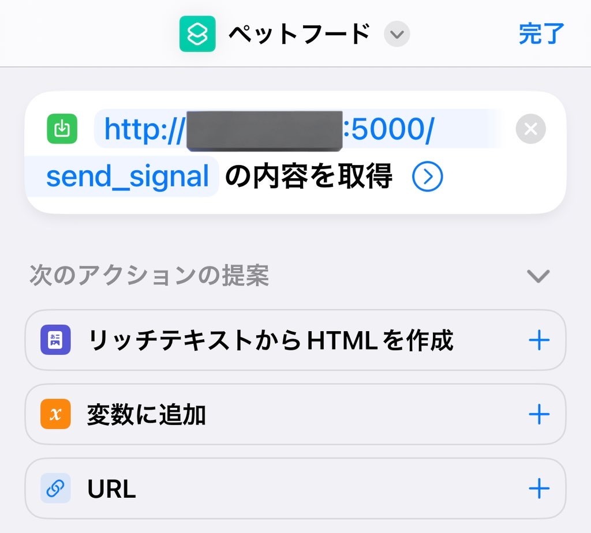
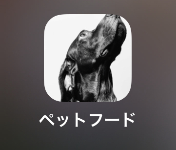

# 自動餌やり器

## 機能

物理ボタンを押すか API を用いることで扉の開閉を行い、ペットフードを放出する。

## API の仕様

http://[ラズパイの IP アドレス]:5000/send_signal に対して POST リクエストを送信すると、ラズパイは Arduino に対してシリアル通信で回転の指示を送る。
詳細は endpoint.py 参照

## iPhone から指示を出すには（推奨）

iPhone にはショートカットというアプリケーションがあり、こちらを利用することで簡単に POST リクエストを送ることができるため、こちらを利用すると良い。

ホーム画面に設定すると、ワンタッチで餌やりができる。

## 時間があれば

- 餌やり時刻の予約機能
- 分量調整
